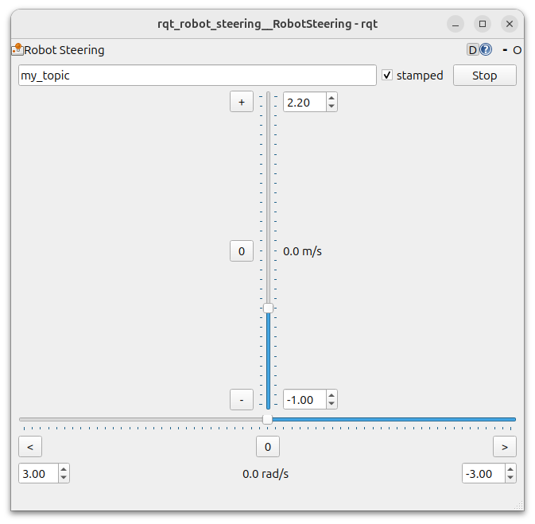

# RQT Robot Steering

This package contains the `rqt_robot_steering` node, an RQT plugin which publishes a Twist (or TwistStamped) containing X linear and Z angular velocities.
This is intended for 2D navigation scenarios.



Settings like the topic name and window size are saved to and restored from `~/.config/ros.org/rqt_gui.ini`.

## Example

```bash
ros2 run rqt_robot_steering rqt_robot_steering --ros-args -p default_topic:=my_topic -p default_stamped:=true -p default_vx_max:=2.2
```

## Published Topics

By default, publisheds to `/cmd_vel`.
The topic name can be changed in the GUI, and will be saved/restored if the GUI is closed cleanly (not Ctrl+C).
You can override this topic name using ROS parameters.

## Parameters

- `default_topic` (string) - The topic name to publish on
- `default_stamped` (bool) - Whether to publish `Twist` or `TwistStamped`
- `default_vx_min` (double) - The minimum X velocity in m/s, used by the vertical slider.
- `default_vx_max` (double) - The maximum X velocity in m/s, used by the vertical slider.
- `default_vw_min` (double) - The minimum Z velocity in rad/s, used by the horizontal slider.
- `default_vw_max` (double) - The maximum Z velocity in rad/s, used by the horizontal slider.

